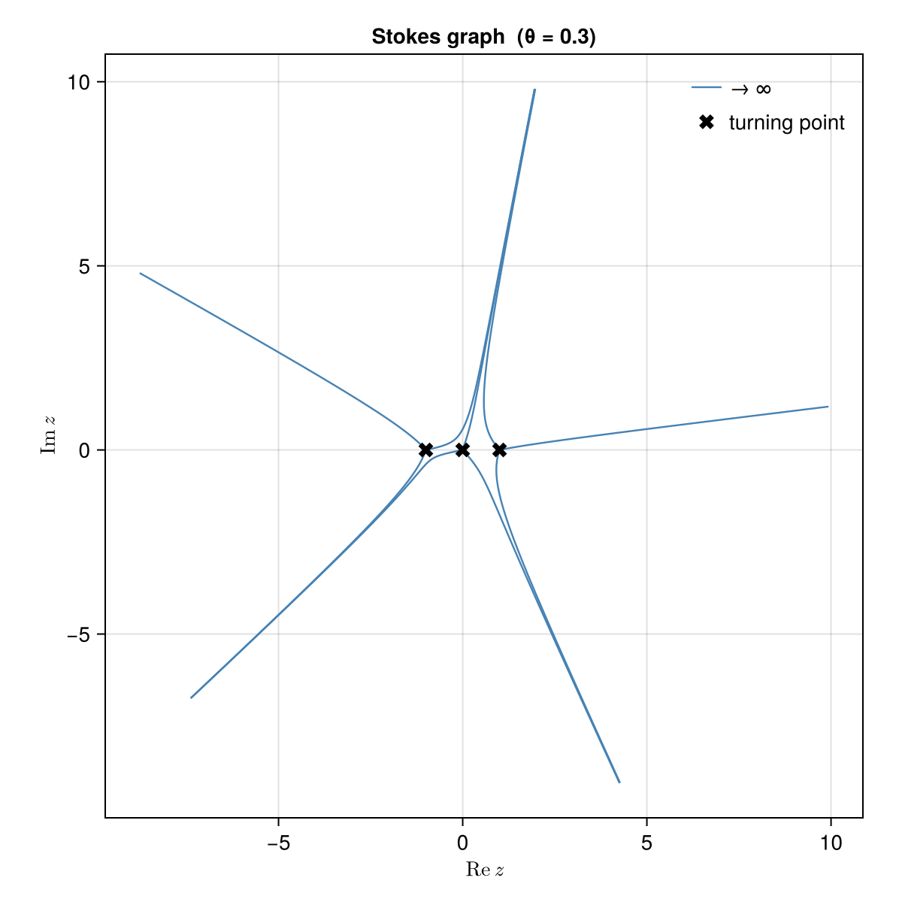
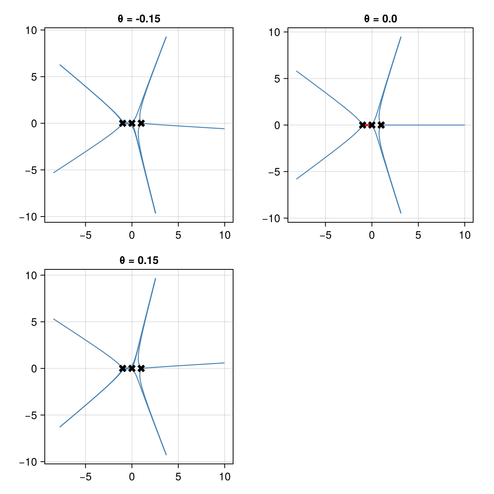
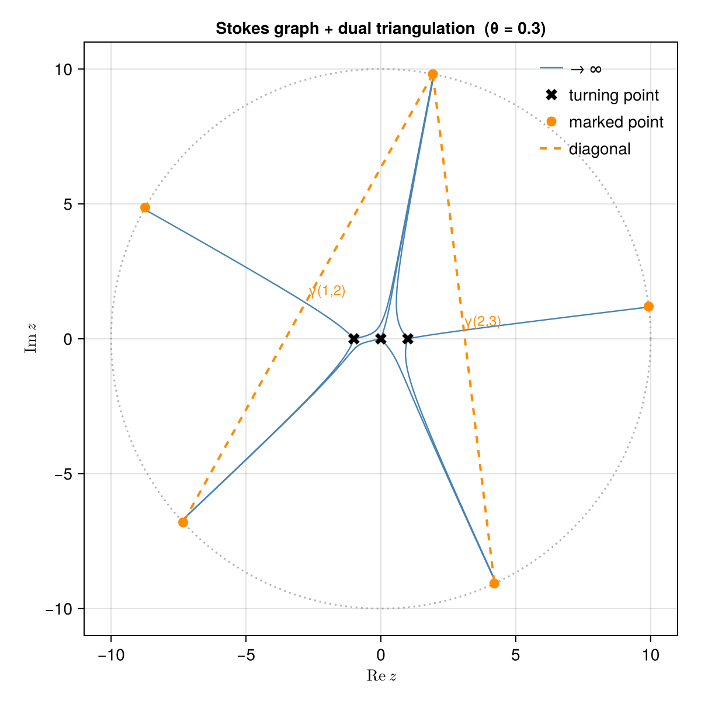
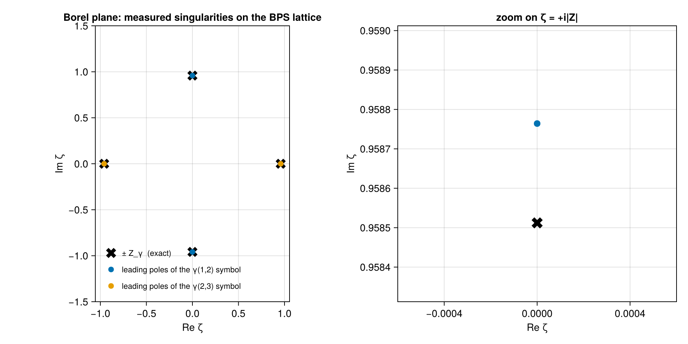
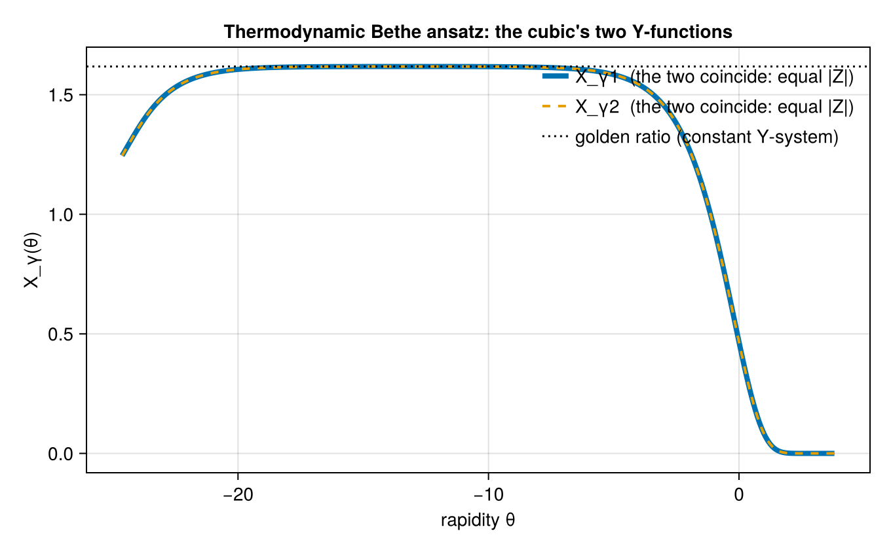

```@meta
CurrentModule = ExactWKB
```

# The cubic, end to end

## The research problem

Write down a differential equation with a small parameter,

```math
\hbar^2\psi''(z) = Q(z)\,\psi(z),
```

and solve it the obvious way: expand in ``\hbar``. The expansion is the
[Wentzel-Kramers-Brillouin approximation](https://en.wikipedia.org/wiki/WKB_approximation), a
century old and in every quantum mechanics textbook, and it does not converge. For any
``\hbar \neq 0`` its coefficients grow factorially and the series has zero radius of
convergence. Truncating it at the smallest term gives a few digits and then a wall.

So a natural question:

> **What is the divergence hiding, and can we recover the exact answer from it?**

The answer is yes, and the divergence is data rather than noise. Where the series diverges
tells you about objects that no order of the expansion can see, and the structure is rigid
enough that a discrete, exactly computable combinatorial object controls it. That is the
subject of *exact* Wentzel-Kramers-Brillouin analysis, and the combinatorial object is a
**cluster algebra**, the same structure that appears in triangulations of surfaces and in
canonical bases in Lie theory.

This tutorial follows the cubic oscillator ``Q(z) = z^3 - z`` through the entire chain and
checks each link:

```
potential → turning points → divergent series → Borel plane
         → Stokes graph → saddle connections → triangulation → quiver
         → charge lattice → BPS spectrum → wall-crossing → integral equations
```

It is the smallest example in which every step does something non-trivial, and small enough
that most answers can be checked by hand. Everything below is real output.

## The two threads

Two independent theories meet in this computation, and the package is organized around the
split.

*Resurgence* is the continuous side: what to do with a divergent series. Its basic tool is the
[Borel transform](https://en.wikipedia.org/wiki/Borel_summation), which divides the ``n``-th
coefficient by ``n!`` and so turns a divergent series into a convergent one. The singularities
of the resulting function carry everything the original series knew about exponentially small
effects, and integrating it back recovers a number. That machinery is
[Resurgence.jl](https://github.com/benedikt-nagler/Resurgence.jl), which knows nothing about
differential equations.

*Cluster algebras* are the discrete side: a set of variables generated from a quiver by a
combinatorial rule called mutation, with a strong positivity and finiteness structure. That is
[ClusterAlgebras.jl](https://github.com/benedikt-nagler/ClusterAlgebras.jl), which knows
nothing about analysis.

This package is the bridge. The dictionary between the two, due to Iwaki and Nakanishi, is what
the second half of the tutorial computes and verifies: the jump of a resummed series across a
Stokes ray *is* a cluster mutation, and the spectrum of the differential equation *is* a
maximal green sequence of a quiver.

## Step 1: the problem and its turning points

Coefficients are given in ascending order, so ``V(z) = -z + z^3`` and ``E = 0``:

```julia-repl
julia> using ExactWKB

julia> import Resurgence, ClusterAlgebras

julia> prob = SchrodingerProblem([0.0, -1.0, 0.0, 1.0])
SchrodingerProblem (ħ²ψ″ = Q ψ, Q = V − E)
  Q(z) = -1.0*z + 1.0*z^3
  E = 0.0

julia> degree(prob), prob(2.0)
(3, 6.0)
```

The zeros of ``Q`` are the turning points, where the classical momentum vanishes and the
expansion below breaks down. Here they are the three cube roots, all simple:

```julia-repl
julia> tps = turning_points(prob)
3-element Vector{TurningPoint{Float64}}:
 TurningPoint(-1.0 + 0.0im, simple)
 TurningPoint(0.0 + 0.0im, simple)
 TurningPoint(1.0 - 0.0im, simple)
```

Simplicity matters: several later steps require it and refuse to proceed otherwise instead of
returning something that looks like an answer. (See [The double well](@ref) for a case where
they collide.)

## Step 2: the divergent series

The substitution ``\psi = \exp(\hbar^{-1}\!\int S\,dz)`` turns the equation into the Riccati
equation ``S^2 + \hbar S' = \hbar^{-2}Q``, solved order by order from ``S_{-1} = \sqrt{Q}``.
[`wkb_expansion`](@ref) runs that recursion:

```julia-repl
julia> w = wkb_expansion(prob; order = 8)
WKBExpansion - all-orders WKB (Riccati) solution
  order      : 8  (S₋₁ … S₈)
  arithmetic : bigfloat
  potential  : SchrodingerProblem(Q deg 3, E = 0.0)
```

Two implementation notes. Every term of the recursion is exactly of the form
``p_m(z)\,\sqrt{Q}^{\,\varepsilon}/Q^{k}``, so the package stores the triple ``(p_m, k,
\varepsilon)`` instead of working in a field of rational functions, which keeps the coefficient
arithmetic clean. And `arithmetic : bigfloat` reports that the recursion is running in extended
precision; exact `Rational` input would stay exact.

Only the odd part of ``S`` matters, because ``S_{\text{even}} = -\tfrac12\partial\log
S_{\text{odd}}`` is a total derivative and integrates to zero around a closed cycle. The package
never uses that identity to compute. It checks it:

```julia-repl
julia> even_odd_residual(w)
6.450861179630544109279055448850406242674120469918688714061254398954872680336836e-73
```

Now integrate around a cycle enclosing two turning points. The result is a *quantum period*, or
Voros symbol, with the leading classical term kept separate:

```julia-repl
julia> vs = voros_symbol(w, encircling_contour(tps[1], tps[2]))
VorosSymbol - quantum period ∮ S dz
  classical v₋₁ = 0.95851 - 4.9613e-16im
  quantum series: FormalSeries{ComplexF64}: -0.3277571942865149 + 4.0592529337857286e-16im*ħ + 0.756794046706105 + 2.913225216616411e-13im*ħ^3 - 9.948605980078156 - 8.202505341614597e-11im*ħ^5 + 322.4783792315138 + 4.863832145929337e-7im*ħ^7 + O(ħ^9)

julia> classical_period(vs)
0.958512187788474 - 4.961309141293668e-16im
```

Two things to notice. The imaginary part is ``10^{-16}``: the period of this cycle is real, and
nothing told the quadrature so. Contours are integrated with ``\sqrt{Q}`` tracked continuously
from vertex to vertex, never chosen by a branch convention, and this is that machinery working.
Second, the coefficients grow: ``-0.33``, ``0.76``, ``-9.9``, ``322``. That is the factorial
divergence the tutorial sets out to exploit.

## Step 3: what the divergence knows

Hand the series to `Resurgence.jl` and ask where its Borel transform is singular. Since the
series is truncated we approximate the Borel function by a rational function (Padé) and look at
its poles:

```julia-repl
julia> P = Resurgence.pade(Resurgence.borel(quantum_series(vs)); reduce = true);

julia> round.(ComplexF64.(Resurgence.poles(P)); sigdigits = 6)
2-element Vector{ComplexF64}:
 -7.21537e-10 - 0.962036im
  7.21537e-10 + 0.962036im
```

Four coefficients of a divergent series give a conjugate pair at ``\pm 0.962\,i``. Keep that
number. It is the central charge of a state not yet computed, one that this cycle knows about
only through how badly its expansion diverges.

## Step 4: the Stokes graph

The geometry that organizes all of this is the Stokes graph: the curves emanating from each
turning point along which ``\mathrm{Im}\bigl(e^{-i\theta}\int\sqrt{Q}\bigr)`` stays constant.
They divide the plane into regions in which one solution dominates the other, and the angle
``\theta`` is the direction in which the Borel integral is taken.

```julia-repl
julia> g = stokes_graph(prob; theta = 0.3)
StokesGraph at θ = 0.3
  turning points : 3
  Stokes lines   : 9 (9 to ∞, 0 saddle-traced)
  saddle edges   : none
  signature      : (3, 9, Tuple{Int64, Int64}[])
```



Three turning points, three lines from each, all nine escaping to infinity. Tracing them is the
most delicate numerical step in the package, because ``\sqrt{Q}`` has branch points exactly at
the turning points where the lines start. The square root is therefore made a dynamical
variable: the pair ``(z, w)`` with ``w = \sqrt{Q}`` is traced together, each obeying its own
equation, so the branch is transported by the integrator and no discrete sign is ever chosen.

A graph in which no line runs from one turning point *into* another is called generic, and this
one is. At special angles that fails: a line connects two turning points and the topology of the
graph jumps. Those are the
[Stokes phenomenon](https://en.wikipedia.org/wiki/Stokes_phenomenon) angles, and
[`saddles`](@ref) finds them by bisection:

```julia-repl
julia> saddles(prob)
2-element Vector{Saddle{Float64}}:
 Saddle(1–2, |Z| = 0.95851, θ_c = 0.0)
 Saddle(2–3, |Z| = 0.95851, θ_c = 1.5708)
```

Two saddle connections of equal mass, at ``\theta = 0`` and ``\theta = \pi/2``. In the physics
reading of this problem these are its BPS states: stable particles with ``|Z|`` the mass and
``\theta_c`` the phase of the central charge. They were found by tracing an ordinary
differential equation. The rest of the tutorial obtains the same list two more times by
different routes.

The mass ``0.9585`` is already the modulus of the pole location ``0.962`` from Step 3, to within
half a percent. The series diverges because of the *other* cycle.

Watching the topology change is the clearest picture of the Stokes phenomenon. The graph just
below, at, and just above ``\theta = 0``:



The middle panel has the saddle connection. On either side it has resolved, but *differently*:
the two outer panels are not related by a small deformation. Everything below is a way of saying
precisely what changed.

## Step 5: from a graph to a quiver

Here the discrete side takes over. A generic Stokes graph of a degree-``d`` polynomial is dual
to an ideal triangulation of a polygon with ``d+2`` marked points: each turning point becomes a
triangle, each region of the graph a vertex of the polygon. For the cubic that is a pentagon.

```julia-repl
julia> t = ideal_triangulation(g)
IdealTriangulation of the 5-gon (dual Stokes regions)
  triangles : 3 (one per turning point)
  diagonals : γ(1, 2) ↔ (2, 4), γ(2, 3) ↔ (2, 5)
```



The conversion is a planar face walk that asserts every genericity invariant as it goes. A
graph with a saddle connection is rejected with a typed error instead of being triangulated
incorrectly.

A triangulated polygon has a quiver: one vertex per diagonal, arrows from the oriented triangles.

```julia-repl
julia> q = triangulation_quiver(t)
Quiver with 2 vertices (2 mutable, 0 frozen)
Exchange matrix B:
   0 -1   (γ(1,2))
   1  0   (γ(2,3))

julia> ClusterAlgebras.cartan_type(q)
(:A, 2)
```

The pentagon with two diagonals is the ``A_2`` cluster algebra, the smallest interesting one,
whose defining feature is that mutating a diagonal five times returns you to the start (the
pentagon recurrence). We arrived at it from a differential equation.

## Step 6: attaching numbers to the combinatorics

The two sides now have to be matched. [`charge_basis`](@ref) builds a cycle per diagonal,
integrates ``\sqrt{Q}`` around it to get a central charge, and counts crossings to get the
intersection pairing:

```julia-repl
julia> cb = charge_basis(prob, t; margin = 0.4)
ChargeBasis - signed frame on the triangulation diagonals
  γ(1, 2) : ε = +1, Z = -0.95851 + 2.55e-16im
  γ(2, 3) : ε = −1, Z = 4.3368e-16 + 0.95851im  (decay rep. -4.3368e-16 - 0.95851im)
  signed pairing = [0 1; -1 0]
```

The ``\varepsilon`` were the subtlest part of the implementation. Orienting a cycle by requiring
its Voros symbol to *decay* fixes a representative of ``\pm\gamma`` and not the physical charge
itself. The sign relating the two is recovered by inverting the identity

```math
P_{ij} = -\,\varepsilon_i \varepsilon_j B_{ij},
```

which ties the numerically computed pairing ``P`` to the combinatorially computed quiver ``B``.
This is the tightest joint in the bridge, a quadrature on one side and a face walk on the
other, and the package enforces it exactly rather than up to sign:

```julia-repl
julia> signed_pairing(cb) == -q.B
true

julia> signs(cb)
2-element Vector{Int64}:
  1
 -1
```

## Step 7: the spectrum as a green sequence

Rotating ``\theta`` sweeps across the walls one at a time. Collecting the charges in the order
their walls are crossed gives the spectrum:

```julia-repl
julia> sp = bps_spectrum(prob; theta = 0.3, margin = 0.4)
BPSSpectrum - 2 BPS states (chamber θ₀ = 0.3, θ-decreasing)
  [1, 0]     |Z| = 0.95851    θ_c = 0.0        Ω = 1
  [0, 1]     |Z| = 0.95851    θ_c = 1.5708     Ω = 1

julia> sp.sequence
2-element Vector{Int64}:
 1
 2
```

The masses and angles are those of the traced saddles, which the constructor checks rather than
assumes. The charges are new: they are ``c``-vectors, and the sequence is a **maximal green
sequence** of the quiver, a purely combinatorial notion that `ClusterAlgebras.jl` computes with
no knowledge of this differential equation:

```julia-repl
julia> ClusterAlgebras.maximal_green_sequences(ClusterAlgebras.extend(ClusterAlgebras.Seed(q)))
2-element Vector{Vector{Int64}}:
 [2, 1]
 [1, 2]

julia> ClusterAlgebras.y_system(bridge_seed(cb)).period
5
```

`[1, 2]` is one of the two, and the period of the associated ``Y``-system is 5: the pentagon
again, in the guise of Zamolodchikov periodicity. These are two counts of the same object, the
stable particles of a differential equation and the green sequences of a quiver.

## Step 8: wall-crossing, where the two threads meet

Now use the structure. Summing a divergent series requires choosing a direction in the Borel
plane. When that direction hits a singularity the two sides give different answers, and the
difference is prescribed. The Delabaere-Dillinger-Pham formula says that across the ray of a
state ``\gamma'``,

```math
s_+(V_\gamma) = s_-(V_\gamma)\,\bigl(1 + V_{\gamma'}\bigr)^{\langle\gamma,\gamma'\rangle},
```

with the exponent the intersection number of the two cycles, an *integer*. It is therefore
something we can measure and compare against combinatorics.

```julia-repl
julia> εc = signs(cb);

julia> vs = [voros_symbol(w, εc[j] == 1 ? c : reverse(c)) for (j, c) in enumerate(cb.contours)];

julia> κ = signed_pairing(cb)[2, 1]
-1

julia> Zwall = abs(physical_charges(cb)[1])
0.9585121877884738

julia> for x in (4.0, 6.0, 8.0)
           r = verify_ddp(vs[2], vs[1], κ, Zwall / x; theta = 0.0)
           println("|Z|/ħ = ", x, "  κ_measured = ", round(real(r.kappa_measured); sigdigits = 8),
                   "  residual = ", round(r.relative_residual; sigdigits = 3))
       end
|Z|/ħ = 4.0  κ_measured = -0.99420632  residual = 0.00579
|Z|/ħ = 6.0  κ_measured = -0.99987408  residual = 0.000126
|Z|/ħ = 8.0  κ_measured = -1.00293  residual = 0.00293
```

The exponent measured from two numerical resummations is ``-1`` to four digits. The accuracy is
best in the middle: below ``|Z|/\hbar \approx 6`` the exponentially small effect is not yet
separated from the perturbative series, and above it the Padé approximant has run out of
coefficients. That non-monotonicity is the normal signature of resummation from a finite number
of terms and not a defect.

Written in terms of the variables ``y_j = V_{\gamma_j}``, that same jump *is* a cluster
mutation, which is the Iwaki-Nakanishi dictionary in one line. [`verify_ddp_mutation`](@ref)
compares the numerically summed jump against ``\mu_1`` computed by `ClusterAlgebras.jl`:

```julia-repl
julia> res = verify_ddp_mutation(vs, bridge_seed(cb), 1, Zwall / 6; theta = 0.0);

julia> res.max_residual
3.2766317564826887e-7
```

Seven digits, between a Borel-Padé resummation of a divergent series and a rational map on two
variables. Mutating in the *other* direction fails by an order of magnitude, so this tests the
dictionary's orientation and is not a tautology.

The lateral sums it is built from are available directly, and their spread is the size of the
effect being measured:

```julia-repl
julia> ħ = Zwall / 6;

julia> round(voros_value(vs[2], ħ; theta = 0.0, side = :plus); sigdigits = 8)
0.97316224 - 0.22440309im

julia> round(voros_value(vs[2], ħ; theta = 0.0, side = :minus); sigdigits = 8)
0.9756976 - 0.22498773im

julia> round(voros_value(vs[2], ħ; theta = 0.0); sigdigits = 8)   # median: the real average
0.97442909 - 0.22469522im
```

## Step 9: closing the loop on Step 3

We can now settle what the divergence of Step 3 was pointing at, properly: exact rational
coefficients, extended precision and order 20, then measure where each symbol's Borel transform
is singular.

```julia-repl
julia> exact_cubic = SchrodingerProblem([0//1, -1//1, 0//1, 1//1]);

julia> setprecision(192) do
           etps = turning_points(exact_cubic)
           w20 = wkb_expansion(exact_cubic; order = 20)
           for (i, j) in ((1, 2), (2, 3))
               v = voros_symbol(w20, encircling_contour(etps[i], etps[j]))
               ps = ComplexF64.(Resurgence.poles(Resurgence.pade(
                        Resurgence.borel(quantum_series(v)); reduce = true)))
               println("cycle γ(", i, ",", j, ")  Z = ",
                       round(ComplexF64(classical_period(v)); sigdigits = 8),
                       "   leading poles ", round.(sort(ps; by = abs)[1:2]; sigdigits = 6))
           end
       end
cycle γ(1,2)  Z = 0.95851219 - 6.8702089e-58im   leading poles ComplexF64[2.87695e-37 + 0.958764im, -2.87695e-37 - 0.958764im]
cycle γ(2,3)  Z = -2.1407173e-58 - 0.95851219im   leading poles ComplexF64[-0.958764 + 2.5202e-37im, 0.958764 - 2.5202e-37im]
```

Those two lines are the whole story. The first cycle has a *real* central charge and its series
diverges at ``\pm i\,|Z|``; the second has an *imaginary* central charge and its series diverges
at ``\pm |Z|`` on the real axis. Each symbol's Borel singularities sit exactly on the central
charge of the **other** state, which is what the wall-crossing formula of Step 8 predicts, since
that is the state whose ray the summation crosses. The measured location ``0.958764`` differs
from the exact ``0.9585122`` by three parts in ten thousand, from twenty coefficients of a
divergent series.



The crosses are the exact central charges computed from the geometry, and the dots are measured
from the divergence. The rough version of the same measurement was Step 3, at order 8 in
`Float64`, which gave ``0.962``, half a percent off. The data sharpens as you compute more of
it.

One caveat applies to every Padé-based measurement: the approximant places its *nearest* poles
well and its further ones badly, and intermediate orders can throw up spurious poles that
disappear again later. Only the leading pair of each symbol is plotted above. Trust pole
positions only where they are stable under raising the order and the precision together.

## Step 10: the same numbers without any series

The last step is the sharpest check in the package. The spectrum is a finite list of complex
numbers and integers, and the conformal limit of the Gaiotto-Moore-Neitzke construction turns
that list back into the resummed quantum periods through a system of integral equations of
[thermodynamic Bethe ansatz](https://en.wikipedia.org/wiki/Bethe_ansatz) type. No
Wentzel-Kramers-Brillouin recursion, no Padé, nothing that remembers the series existed:

```julia-repl
julia> sol = solve_tba(sp)
TBASolution(2 states, 343-point grid, 20 sweeps, residual 4.9754e-11)

julia> round(voros_value(sol, 2, ħ); sigdigits = 10)
0.9744282723 - 0.2246987811im
```

Compare with the Borel-Padé median sum from Step 8:

```
thermodynamic Bethe ansatz   0.9744282723 - 0.2246987811im
Borel-Padé median sum        0.97442909   - 0.22469522im
```

Six digits, from two computations sharing only the geometry of the problem. The
integral-equation side is the more accurate of the two, since nothing in it is truncated, which
makes this the package's strongest check on the resummation pipeline.

The solution also remembers the cluster algebra. Deep in the infrared the two functions flow to
a constant solution of the ``A_2`` ``Y``-system ``X^2 = 1 + X``:

```julia-repl
julia> k = findfirst(θ -> θ > sol.grid[1] + 12, sol.grid);

julia> round(real(exp(sol.gplus[k, 1])); sigdigits = 8), round((1 + sqrt(5)) / 2; sigdigits = 8)
(1.6179214, 1.618034)
```



The golden ratio, to four digits, from an integral equation whose only input was two central
charges and an intersection number.

## Step 11: chambers, and what does not depend on them

Nothing above was special to ``\theta = 0.3``. The walls cut the circle of angles into chambers:

```julia-repl
julia> chamber_walls(prob)
2-element Vector{Tuple{Float64, Vector{Tuple{Int64, Int64}}}}:
 (0.0, [(1, 2)])
 (1.5707963267948966, [(2, 3)])
```

Crossing one flips a diagonal of the triangulation, and a flip is a quiver mutation, the
combinatorial shadow of the topology change seen in Step 4:

```julia-repl
julia> tp = ideal_triangulation(stokes_graph(prob; theta =  0.15));

julia> tm = ideal_triangulation(stokes_graph(prob; theta = -0.15));

julia> ClusterAlgebras.mutate(triangulation_quiver(tp), 1).B == triangulation_quiver(tm).B
true
```

The spectrum itself does not depend on where you start. Only its ordering does:

```julia-repl
julia> spb = bps_spectrum(prob; theta = 2.0);

julia> charges(spb)
2-element Vector{Vector{Int64}}:
 [0, 1]
 [1, 0]

julia> sort([mass(s) for s in sp.states]) ≈ sort([mass(s) for s in spb.states])
true
```

## What was computed

One list of four coefficients produced, with no other input:

- a divergent series whose Borel singularities sit on the central charges of states not yet
  computed;
- two saddle connections traced from an ordinary differential equation;
- a pentagon triangulation and the ``A_2`` quiver, with the pairing matching the quiver exactly;
- a maximal green sequence, agreeing with one that `ClusterAlgebras.jl` computes independently,
  and a ``Y``-system of period 5;
- a wall-crossing exponent measured as ``-1`` from resummed numerics, and a wall-crossing map
  agreeing with a cluster mutation to seven digits;
- an integral-equation solution reproducing the resummed periods to six digits and the golden
  ratio in the infrared.

Scope: polynomial potentials with simple turning points triangulate a polygon, so the cluster
types reachable along the route above are exactly the ``A_n`` family. Degree 4 and 5 potentials
work the same way and give ``A_3`` and ``A_4``, and the quartic is the double well of the next
tutorial. Other types need a rational ``Q``, whose poles put the triangulation on a surface with
boundary circles and punctures; see [Problems and turning points](problems.md) and
[The cluster bridge](bridge.md). Higher-order turning points are handled there too, by
[`polygon_decomposition`](@ref) in place of a triangulation.

Where to go next:

- [The double well](@ref) turns this machinery into a spectral method: real eigenvalues, a level
  splitting invisible to perturbation theory, and an exact relation between the perturbative and
  instanton series.
- [Seiberg-Witten SU(2)](@ref) does the same physics for a four-dimensional gauge theory, where
  the quiver is affine rather than finite type and the spectrum is an infinite tower.
- [The cluster bridge](bridge.md) documents each function used above.
