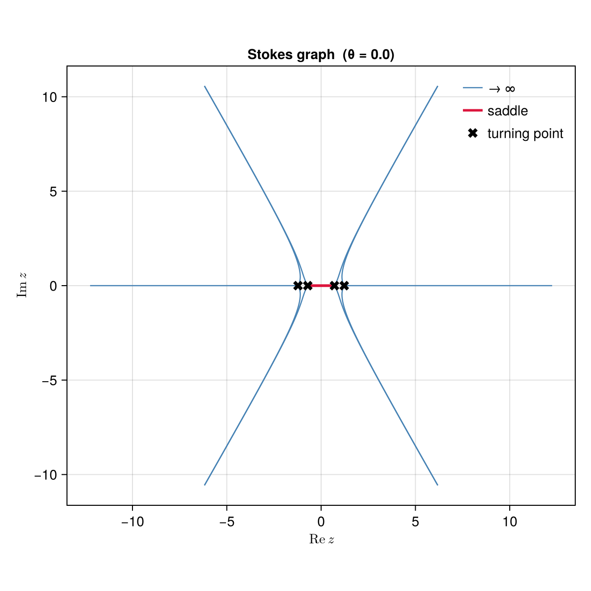
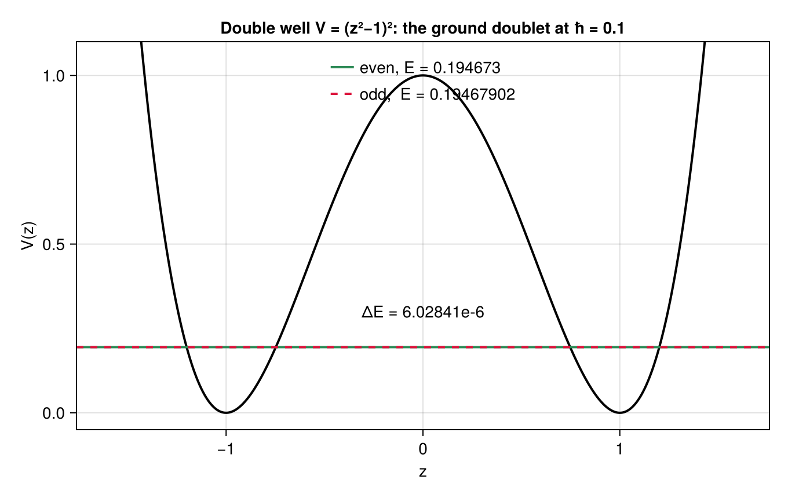
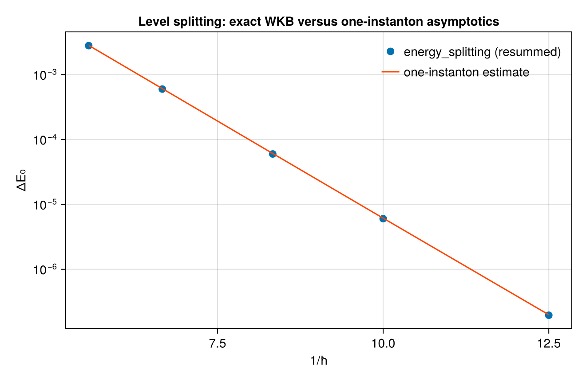
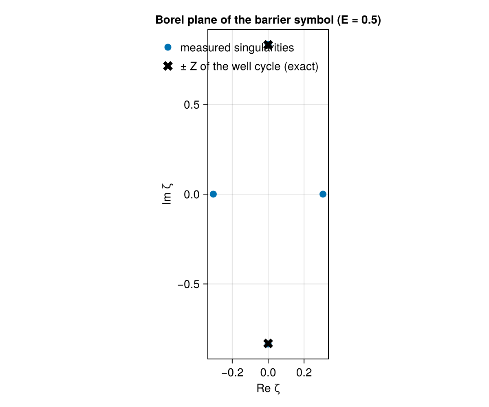

```@meta
CurrentModule = ExactWKB
```

# The double well

## The research problem

A particle in a symmetric double well has two places to sit. Classically it picks one and stays
there forever; quantum mechanically it tunnels, and the two would-be ground states mix into an
even and an odd combination separated by a small energy gap ``\Delta E``. Measuring that gap is
measuring the tunnelling rate.

Perturbation theory cannot see it. Expand the ground-state energy in powers of ``\hbar`` around
either well and you get *the same series* for both members of the doublet, so the gap is zero to
all orders. It is exponentially small,
``\Delta E \sim e^{-A/\hbar}``, and no finite order of an expansion in powers of ``\hbar``
contains such a term.

So:

> **How do you compute a quantity that vanishes to all orders of the only expansion you have?**

The textbook answer adds instantons by hand: find the classical tunnelling solution, compute
its action ``A``, and multiply by a fluctuation determinant. That works and gives the leading
behaviour. The exact-Wentzel-Kramers-Brillouin answer goes further: the perturbative series
*already contains* the tunnelling information, in the pattern of its divergence, and both
objects come out of the same computation. The perturbative series and the instanton series are
not independent, but satisfy an exact differential relation.

This tutorial computes the gap, checks it against the instanton estimate, and then verifies that
relation. Along the way it shows what the tunnelling looks like as *geometry*: a line in the
complex plane connecting two turning points.

This is the same [resurgence](https://en.wikipedia.org/wiki/Borel_summation) story as
[The cubic, end to end](@ref), with divergent series, a Borel plane and singularities at the
actions of invisible objects, but here the result is a number a physicist would measure and the
invisible object is an instanton. [Seiberg-Witten SU(2)](@ref) is the same structure one
dimension up: the Mathieu potential is a periodic double well, and its two periods are the two
series computed here.

## A convention check first

Before trusting any of it, run the machinery on a problem whose answer is known exactly. For the
harmonic oscillator ``V = z^2`` the Wentzel-Kramers-Brillouin series *truncates*, since all
higher corrections vanish identically, so the method must return
``E_n = 2\hbar(n+\tfrac12)`` exactly and not asymptotically:

```julia-repl
julia> using ExactWKB

julia> import Resurgence

julia> harm = SchrodingerProblem([0.0, 0.0, 1.0]);

julia> wkb_eigenvalue(harm, 0, 0.1; order = 6), wkb_eigenvalue(harm, 3, 0.1; order = 6)
(0.09999999999999994, 0.6999999999999995)
```

Fifteen digits on both. Every sign, every factor of ``2\pi``, and the placement of the
``+\tfrac12`` in the quantization condition is pinned by this one line. It is the cheapest test
available, and the package runs it in its own test suite for that reason.

## Step 1: the potential, and a reported degeneracy

```julia-repl
julia> dwell = SchrodingerProblem([1.0, 0.0, -2.0, 0.0, 1.0])
SchrodingerProblem (ħ²ψ″ = Q ψ, Q = V − E)
  Q(z) = 1.0 - 2.0*z^2 + 1.0*z^4
  E = 0.0

julia> turning_points(dwell)
2-element Vector{TurningPoint{Float64}}:
 TurningPoint(-1.0 - 4.4254e-23im, order 2)
 TurningPoint(1.0 - 3.1115000000000004e-33im, order 2)
```

At ``E = 0`` the energy sits exactly at the bottom of both wells, so the four turning points
have collided pairwise into two *double* zeros. The package reports `order 2` instead of four
nearby simple points, and any function that needs simple turning points refuses this input with
a typed error rather than tracing through a degenerate point.

Lift the energy and the degeneracy resolves:

```julia-repl
julia> prob = with_energy(dwell, 0.25);

julia> turning_points(prob)
4-element Vector{TurningPoint{Float64}}:
 TurningPoint(-1.2247 + 0.0im, simple)
 TurningPoint(-0.70711 + 2.4309e-63im, simple)
 TurningPoint(0.70711 + 4.8617000000000003e-63im, simple)
 TurningPoint(1.2247 + 1.2154e-63im, simple)
```

Two outer turning points, where the classical motion turns around, and two inner ones bounding
the barrier.

## Step 2: the instanton as geometry

The Stokes graph at angle ``\theta = 0`` makes the rest of the tutorial concrete:

```julia-repl
julia> g = stokes_graph(prob; theta = 0.0)
StokesGraph at θ = 0.0
  turning points : 4
  Stokes lines   : 12 (10 to ∞, 2 saddle-traced)
  saddle edges   : (2, 3)
  signature      : (4, 10, [(2, 3)])
```



Ten lines escape to infinity and two do not: they join turning point 2 to turning point 3, the
two ends of the barrier. That connection is the instanton, and it is *visible* as a piece of
graph topology instead of being put in as an ansatz. [`saddles`](@ref) lists all such
connections with their actions:

```julia-repl
julia> saddles(prob)
3-element Vector{Saddle{Float64}}:
 Saddle(1–2, |Z| = 0.40287, θ_c = 1.5708)
 Saddle(2–3, |Z| = 1.8399, θ_c = 3.8763e-66)
 Saddle(3–4, |Z| = 0.40287, θ_c = 1.5708)
```

Three of them: one per well (action ``0.403``, critical angle ``\pi/2``) and one for the barrier
(action ``1.84``, critical angle ``0``). Their angles differ by exactly ``\pi/2``, which is the
geometric reason the two effects separate so cleanly. The perturbative series lives on one ray
of the Borel plane and the tunnelling on the other.

## Step 3: the two cycles

Turning the machinery into a spectral method means letting the energy vary.
[`spectral_cycles`](@ref) classifies the cycles at a given energy:

```julia-repl
julia> cyc = spectral_cycles(dwell, 0.3)
3-element Vector{SpectralCycle{Float64}}:
 SpectralCycle(:well, -1.2441 ↔ -0.67252)
 SpectralCycle(:barrier, -0.67252 ↔ 0.67252)
 SpectralCycle(:well, 0.67252 ↔ 1.2441)
```

Two allowed regions, and the forbidden region between them. [`quantum_period`](@ref) runs the
full expansion on either of them (pass the cycle itself, since here there is more than one of
the `:well` kind):

```julia-repl
julia> quantum_period(dwell, cyc[3], 0.3; order = 8)
VorosSymbol - quantum period ∮ S dz
  classical v₋₁ = 3.2613e-16 - 0.48622im
  quantum series: FormalSeries{ComplexF64}: -5.507747036226363e-16 - 0.2602076530591245im*ħ + 3.2862601528904634e-14 - 0.18336635781953703im*ħ^3 + 7.275957614183426e-12 - 0.7278166054729809im*ħ^5 - 1.160697138402611e-8 - 7.1768695019236475im*ħ^7 + O(ħ^9)

julia> quantum_period(dwell, cyc[2], 0.3; order = 8)
VorosSymbol - quantum period ∮ S dz
  classical v₋₁ = -1.7005 + 2.1858e-16im
  quantum series: FormalSeries{ComplexF64}: 1.2437132716233077 - 1.5543122344752192e-15im*ħ - 11.03975702252379 + 7.460698725481052e-14im*ħ^3 + 570.9633005980559 - 1.8189894035458565e-11im*ħ^5 - 72571.23867070675 + 5.334615707397461e-6im*ħ^7 + O(ħ^9)
```

The well period is purely imaginary and the barrier period purely real, which is the two rays
again. The barrier's classical part ``-1.7005`` is the instanton action at this energy, and it
reappears in Step 6 as the leading term of the series called ``A``.

## Step 4: eigenvalues from an exact quantization condition

The old Bohr-Sommerfeld rule makes the action a multiple of ``\hbar``. The exact version
replaces the action by the resummed quantum period and, for a symmetric double well, factorizes
by parity:

```math
\cos\varphi = \frac{\sigma}{2}\sqrt{\frac{V_A}{1+V_A}},
\qquad \sigma = \text{parity}\cdot(-1)^n,
```

where ``\varphi`` is built from the well period and ``V_A`` from the barrier period. The
tunnelling term ``V_A = e^{-A/\hbar}\cdot(\text{series})`` splits the two parities. Drop it and
both members of the doublet collapse onto the same energy.

The condition itself is available as a residual, but usually you want its zero:

```julia-repl
julia> quantization_condition(dwell, 0.3, 0.1; n = 0, parity = +1, order = 8)
-0.7666241320998459

julia> E_even = wkb_eigenvalue(dwell, 0, 0.1; parity = +1, order = 8)
0.1946729954639906

julia> E_odd  = wkb_eigenvalue(dwell, 0, 0.1; parity = -1, order = 8)
0.19467902387304717
```

Two levels agreeing to six digits and differing in the seventh. Here they are, drawn on the
potential:



At this scale the two lines are indistinguishable. The gap between them is the quantity
perturbation theory says is zero:

```julia-repl
julia> energy_splitting(dwell, 0, 0.1; order = 8)
6.02840905655766e-6
```

Six parts in a million, obtained without ever writing down an instanton. It appears because the
quantization condition was Borel summed instead of truncated, and the summation sees the barrier
period.

Each eigenvalue takes a few seconds in `Float64` at order 8, and the splitting about twice that.
The cost is the expansion, which is re-run at every Newton step. Raising `order` or working in
`BigFloat` buys digits at proportionate cost.

## Step 5: comparison with the instanton estimate

Linearizing the parity condition gives the textbook one-instanton estimate
``\Delta E \approx \sqrt{V_A}\,/\,|d\varphi/dE|``, and every ingredient is available:
[`instanton_a`](@ref) for the tunnelling series, [`perturbative_b`](@ref) for the perturbative
one.

```julia-repl
julia> for h in (0.1, 0.12, 0.15)
           ΔE = energy_splitting(dwell, 0, h; order = 8)
           E0 = wkb_eigenvalue(dwell, 0, h; parity = +1, order = 8)
           δ  = 1e-4
           A  = instanton_a(dwell, E0; order = 6)
           dφdE = π * real(Resurgence.evaluate(perturbative_b(dwell, E0 + δ; order = 6) -
                                               perturbative_b(dwell, E0 - δ; order = 6), h)) / (2δ)
           VA = exp(-real(Resurgence.evaluate(A, h)))
           println("ħ = ", h, "   ΔE = ", round(ΔE; sigdigits = 6),
                   "   one-instanton = ", round(sqrt(VA) / abs(dφdE); sigdigits = 6))
       end
ħ = 0.1    ΔE = 6.02841e-6    one-instanton = 6.13171e-6
ħ = 0.12   ΔE = 5.98252e-5    one-instanton = 6.08478e-5
ħ = 0.15   ΔE = 0.000599225   one-instanton = 0.000608403
```

Over a wider range the agreement is the straight line on a logarithmic plot that the
exponential law predicts:



The splitting varies over orders of magnitude and the estimate tracks it to a couple of percent.
The residual is physics and not numerical error: two-instanton effects and the perturbative
corrections *around* the instanton, which the exact condition includes and the leading estimate
drops. The exact-WKB number is the one to trust, since it is a resummation and not an asymptotic
estimate.

## Step 6: the two series and the relation between them

Now the structural result. The problem has two ``\hbar``-series: the perturbative ``B``, from the
well cycle, and the instanton ``A``, from the barrier.

```julia-repl
julia> instanton_a(dwell, 0.3; order = 6)
FormalSeries{ComplexF64}: 1.7004952149108605 - 2.185751579730777e-16im*ħ^-1 - 1.2437132716233077 + 1.5543122344752192e-15im*ħ + 11.03975702252379 - 7.460698725481052e-14im*ħ^3 - 570.9633005980559 + 1.8189894035458565e-11im*ħ^5 + O(ħ^7)

julia> perturbative_b(dwell, 0.3; order = 6)
FormalSeries{ComplexF64}: 0.077383985679791 - 4.831571781737113e-17im*ħ^-1 + 0.04141333421470072 - 1.9326287126948452e-17im*ħ + 0.029183662243720702 + 6.785183320455502e-15im*ħ^3 + 0.11583561042886273 + 5.211020790109826e-12im*ħ^5 + O(ħ^7)
```

``A`` starts at the instanton action ``1.70049`` from Step 3 and ``B`` at the perturbative
action. Both diverge, and they are not independent. The Zinn-Justin-Jentschura relation, in the
form given by Dunne and Ünsal, says

```math
\frac{1}{\partial B/\partial E} = -c\,\hbar^3
\left.\frac{\partial A}{\partial \hbar}\right|_{B},
```

so the entire non-perturbative sector is *determined* by perturbation theory.

[`verify_zjj`](@ref) checks it order by order, fitting the constant ``c`` instead of being told
it:

```julia-repl
julia> r = setprecision(160) do
           verify_zjj(dwell, big(1)/2; order = 7, quad_rtol = 1e-20)
       end;

julia> Float64(real(r.c))
1.5

julia> r.orders, Float64.(r.residuals)
([3, 5], [1.3359157290179344e-22, 5.693993336044132e-21])
```

The fit lands on ``c = 3/2``, the exact value for this potential, and the residuals at the next
two orders vanish at the working precision, twenty digits. Two divergent series, one computed in
the classically allowed region and one under the barrier, satisfy an exact differential
relation. That is resurgence made concrete, and it is why the splitting could be computed at all
without putting an instanton in by hand.

## Step 7: the same fact in the Borel plane

The relation above has a geometric counterpart. Take the barrier series at ``E = 0.5`` and ask
where its Borel transform is singular:

```julia-repl
julia> cyc = spectral_cycles(dwell, 0.5);

julia> vw = quantum_period(dwell, cyc[3], 0.5; order = 8);   # a well cycle

julia> vb = quantum_period(dwell, cyc[2], 0.5; order = 12);  # the barrier

julia> round(classical_period(vw); sigdigits = 8), round(classical_period(vb); sigdigits = 8)
(1.8041124e-16 - 0.83146318im, -1.1758665 - 3.8510861e-16im)

julia> P = Resurgence.pade(Resurgence.borel(quantum_series(vb)); reduce = true);

julia> round.(ComplexF64.(Resurgence.poles(P)); sigdigits = 6)
4-element Vector{ComplexF64}:
    -0.305354 - 1.99506e-7im
     0.305354 + 1.99506e-7im
 -2.27694e-11 + 0.834605im
  2.27694e-11 - 0.834605im
```



The conjugate pair at ``\pm 0.8346\,i`` matches the well cycle's action ``\mp 0.83146\,i`` to
0.4%. The barrier series diverges *because of* the well cycle and vice versa, which is the
statement of Step 6 read in the complex plane instead of order by order.

One caveat, generic to this kind of measurement: the pair at ``\pm 0.305`` is at the resolution
limit of a rational approximation built from six coefficients. Padé approximants
place their nearest poles well and their further ones badly, and intermediate orders can produce
spurious poles that vanish again at higher order. Raise the order and the precision together
before reading anything into a pole position. [The cubic, end to end](@ref) shows the converged
version of the same measurement, where at order 20 in exact arithmetic the leading singularity
sits on the exact action to three parts in ten thousand.

To look at the Borel plane directly, the plotting comes from `Resurgence.jl`:

```julia
using CairoMakie
Resurgence.plot_borel_plane(P; rays = [0.0])
```

## What was computed

From five coefficients:

- a Stokes graph in which the instanton is a visible edge joining the two ends of the barrier,
  with its action ``1.84`` computed as a contour integral;
- the ground doublet at ``\hbar = 0.1``, and a splitting of ``6.03\times 10^{-6}`` that is zero
  to all orders of perturbation theory;
- agreement with the one-instanton estimate to a couple of percent across a range where the
  splitting varies by orders of magnitude, with the discrepancy attributable to effects the
  estimate omits;
- the Zinn-Justin-Jentschura relation between the perturbative and instanton series, verified to
  twenty digits with its constant ``3/2`` fitted rather than assumed;
- the Borel singularities of each series sitting on the other cycle's action.

Scope: `wkb_eigenvalue` and `energy_splitting` handle a single well and a symmetric double well.
Asymmetric wells, more than two wells, and complex spectra are not implemented. They need
further quantization-condition layouts, not new machinery underneath.

Next: [Seiberg-Witten SU(2)](@ref), where the well-and-barrier structure becomes a periodic
potential, the two series become the electric and magnetic periods of a gauge theory, and the
tunnelling action becomes the mass of a magnetic monopole.
