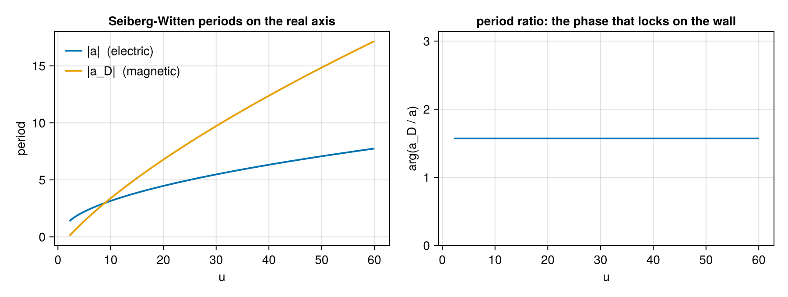
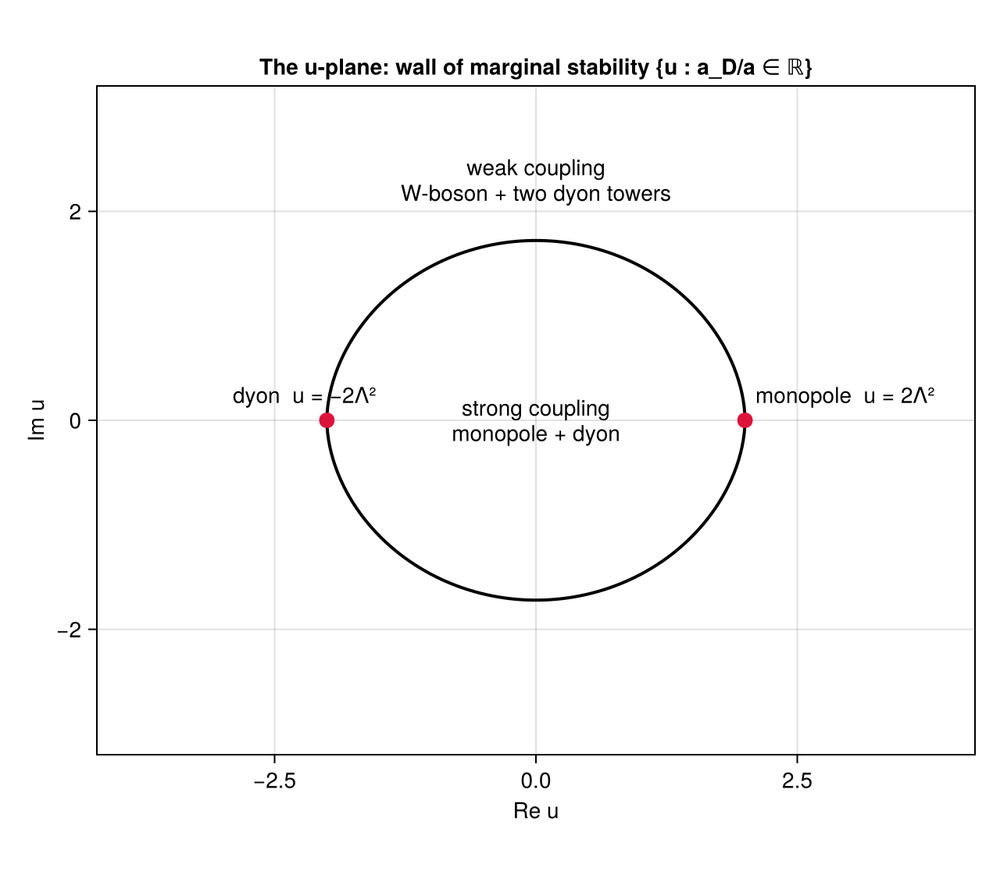
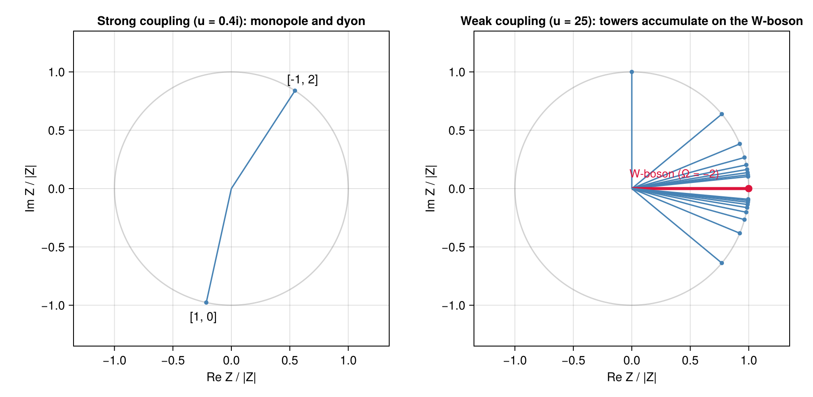
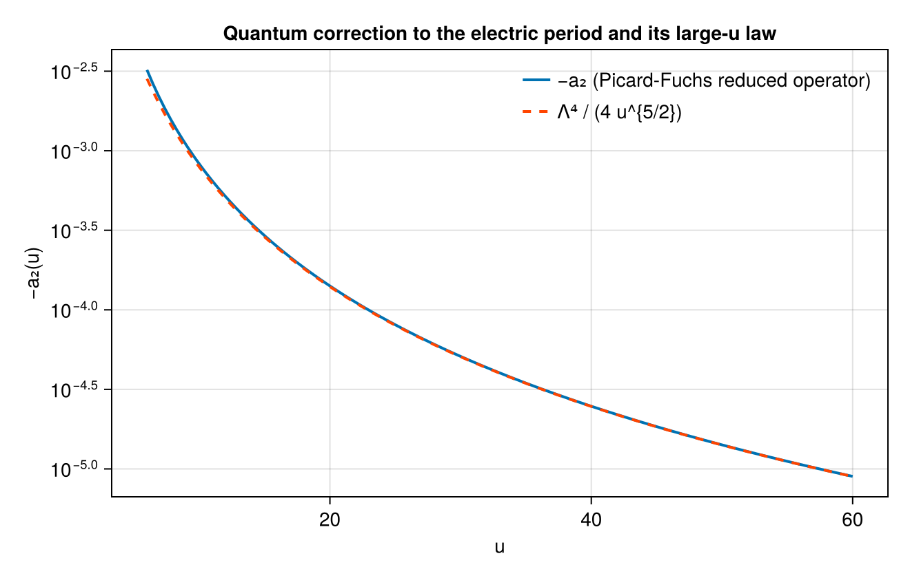

```@meta
CurrentModule = ExactWKB
```

# Seiberg-Witten SU(2)

## The research problem

A quantum field theory at strong coupling is hard for a simple reason: the objects you can
calculate with (fields, Feynman diagrams) are not the objects that exist (particles, bound
states). Perturbation theory answers "what happens if the coupling is small". It says nothing
about which particles are stable when it is not - and the answer can change discontinuously as
you move through the space of vacua, with bound states forming and decaying.

The concrete question this tutorial answers, for one specific four-dimensional theory, is:

> **Which particles exist, what are their masses, and how does that list change as the vacuum
> is varied?**

Seiberg and Witten answered it in 1994 for the pure ``SU(2)`` gauge theory with
``\mathcal N = 2`` supersymmetry, and the answer is famous partly because it is *exact* - not a
perturbative expansion. The mechanism: the whole low-energy theory is encoded in the geometry
of an auxiliary elliptic curve, and the masses are integrals - *periods* - over cycles of that
curve.

What we do below is compute every piece of that answer with code, from one input number, and
verify each piece against something independent:

| Step | Computed | Verified against |
|------|----------|------------------|
| periods ``a(u)``, ``a_D(u)`` | closed form, whole plane | the three-instanton weak-coupling series |
| monodromy | transport of a differential equation | exactness of the integer matrices, and their factorization |
| wall of marginal stability | bisection on the period ratio | the literature value of its crossing point |
| spectrum, strong coupling | two states | the wall-crossing identity |
| spectrum, weak coupling | infinite tower | the same identity, closing exactly |
| quantum corrections | Picard-Fuchs reduced operator | an independent quadrature and the known large-``u`` law |

Everything here runs in a few seconds, and the whole tutorial uses no series resummation at
all - which is worth noting, because resummation is what the rest of this package is about.
The reason is explained at the end.

## The theory, briefly

Some background, enough to make the code meaningful. Skip to
[Setting up](@ref) if you know it.

**The Coulomb branch.** This theory has a family of inequivalent vacua - a one-complex-dimensional
space, parametrized by a coordinate ``u``. Classically ``u = \langle\mathrm{tr}\,\phi^2\rangle``
measures how the gauge symmetry is broken. Large ``|u|`` is *weak coupling*, where the theory
looks like electrodynamics with a heavy W-boson; small ``|u|`` is *strong coupling*, where it
does not look like anything familiar.
([Seiberg-Witten theory on Wikipedia](https://en.wikipedia.org/wiki/Seiberg%E2%80%93Witten_theory).)

**Charges and masses.** A stable particle carries an electric charge ``n_e`` and a magnetic
charge ``n_m``, both integers. Supersymmetry gives every such state a *central charge*, a
complex number

```math
Z_{(n_m,n_e)}(u) = n_m\, a_D(u) + n_e\, a(u),
```

and forces the mass bound ``M \geq |Z|``. States saturating it - Bogomolny-Prasad-Sommerfield
states, universally abbreviated BPS - have masses that are *exactly* ``|Z|``, with no quantum
corrections. So computing masses reduces to computing the two functions ``a(u)`` and
``a_D(u)``: the electric and magnetic periods.
([The bound on Wikipedia](https://en.wikipedia.org/wiki/Bogomol%27nyi%E2%80%93Prasad%E2%80%93Sommerfield_bound).)

**Where the periods come from.** They are integrals over the two independent cycles of an
elliptic curve fibered over the ``u``-plane. At two special values of ``u`` the curve
degenerates, a cycle shrinks to nothing, and the corresponding state becomes massless: a
magnetic monopole at ``u = +2\Lambda^2`` and a dyon (a state with both charges) at
``u = -2\Lambda^2``. Here ``\Lambda`` is the dynamically generated scale - the theory's only
dimensionful parameter, the analogue of ``\Lambda_{\text{QCD}}``.

**Why the answer is subtle.** Going around a singular point continuously permutes the two
periods: a *monodromy*. Because ``(a_D, a)`` is a basis of a lattice of charges, that
permutation is an integer matrix, and the three monodromies (around the two singularities and
around infinity) must be consistent. That constraint is essentially what fixes the solution.
And the stable spectrum is not constant: there is a closed curve on the ``u``-plane - the *wall
of marginal stability* - across which the list of stable particles changes completely. Inside
it, two states; outside, infinitely many.

**Why this is an exact Wentzel-Kramers-Brillouin problem.** Take the same theory in a particular
supersymmetry-breaking deformation - the Nekrasov-Shatashvili limit - and it becomes an
ordinary differential equation with a small parameter ``\hbar``: the
[Mathieu equation](https://en.wikipedia.org/wiki/Mathieu_function). In this package's
normalization ``\hbar^2\psi'' = (V - E)\psi``, that is

```math
V(x) = 2\Lambda^2\cos 2x, \qquad E = u .
```

The electric period is the classical action of a particle oscillating in a well of that cosine
potential; the magnetic period is the action of the classically forbidden motion *through* the
barrier - a tunnelling action. Everything you know about the double well (see
[The double well](@ref)) applies verbatim: ``a`` is the perturbative object, ``a_D`` is the
instanton, and the ``\hbar``-expansion of either one diverges.

Two threads run through the package and meet here:

- **Resurgence.** The ``\hbar``-expansions of the periods are divergent series whose Borel
  singularities sit on the central charges of BPS states. The correction terms below are the
  start of that expansion; the machinery for summing them is
  [Resurgence.jl](https://github.com/benedikt-nagler/Resurgence.jl).
- **Cluster algebras.** The BPS spectrum is the representation theory of a quiver, and moving
  across a wall of marginal stability is a quiver *mutation*. For this theory the quiver is the
  Kronecker quiver, and the fact that it has infinitely many clusters is the fact that the
  weak-coupling spectrum is an infinite tower. That side of the computation lives in
  [ClusterAlgebras.jl](https://github.com/benedikt-nagler/ClusterAlgebras.jl).

## Setting up

The only input is ``\Lambda``. Set it to 1 and every mass below is in units of the dynamical
scale:

```julia-repl
julia> using ExactWKB

julia> import Resurgence, ClusterAlgebras

julia> sw = SeibergWittenSU2()          # Λ = 1
SeibergWittenSU2 - pure SU(2) N=2 Seiberg–Witten geometry
  Λ            : 1.0
  singularities: monopole u = 2.0, dyon u = -2.0

julia> sw_singularities(sw)
(monopole = 2.0, dyon = -2.0)
```

Three punctures on the ``u``-plane - the two above plus the point at infinity - and everything
that follows is a consequence of them.

## Step 1: periods, and a check at weak coupling

[`sw_periods`](@ref) returns both periods at once:

```julia-repl
julia> sw_periods(sw, 10.0)
(a = 3.1542965233667855 + 0.0im, a_D = 0.0 + 3.386364195051362im)
```

Is that right? At weak coupling there is an independent answer to compare with. The classical
relation is ``u = a^2``, and the quantum corrections are an instanton expansion whose
coefficients are known:

```math
u(a) = a^2 + \frac{\Lambda^4}{2a^2} + \frac{5\Lambda^8}{32a^6}
       + \frac{9\Lambda^{12}}{64a^{10}} + \dots
```

The three terms after the first are the one-, two- and three-instanton contributions. Inverting
our computed ``a(u)`` should reproduce ``u``:

```julia-repl
julia> for u in (10.0, 25.0, 100.0)
           a = real(sw_periods(sw, u).a)
           u_ser = a^2 + 1/(2a^2) + 5/(32a^6) + 9/(64a^10)
           println("u = ", rpad(u, 6), "  a = ", round(a; sigdigits = 8),
                   "   u − series = ", round(u - u_ser; sigdigits = 3))
       end
u = 10.0    a = 3.1542965   u − series = 1.89e-8
u = 25.0    a = 4.997997    u − series = 2.96e-11
u = 100.0   a = 9.99975     u − series = -5.68e-14
```

The mismatch falls like the next (four-instanton) term as ``u`` grows: at ``u = 100`` the
agreement is thirteen digits. This is what pins the normalization of ``a`` - and it is a real
check, since the instanton coefficients were computed by an entirely different method
(localization on instanton moduli space) than our elliptic integral.

The magnetic period is the interesting one. Near the monopole point it vanishes linearly, which
is the entire mechanism of the Seiberg-Witten solution - a particle becoming massless is what
makes the strong-coupling physics tractable:

```julia-repl
julia> sw_periods(sw, 2.0 + 1e-6)
(a = 1.2732410546693917 + 0.0im, a_D = 0.0 + 4.999999847313274e-7im)
```

``a_D \approx 5\times10^{-7}`` at distance ``10^{-6}`` from the singularity: a monopole with a
mass we can drive to zero at will.

Both periods are available anywhere on the complex plane, not just on the real axis. They are
evaluated in closed form through complete elliptic integrals

```math
a(u) = \frac{2}{\pi}\sqrt{u+2\Lambda^2}\,E(\tilde m), \qquad
a_D(u) = -\frac{8i\Lambda}{\pi}\bigl[E(m) - (1-m)K(m)\bigr],
```

with ``\tilde m = 4\Lambda^2/(u+2\Lambda^2)`` and ``m = (2\Lambda^2-u)/4\Lambda^2``. Standard
elliptic-integral libraries take real parameters only, so these are evaluated through Carlson
symmetric forms, which are happy with complex arguments:

```julia-repl
julia> sw_periods(sw, 0.5 + 0.3im)
(a = 0.7735007416607571 + 0.48877104905980434im, a_D = -0.16801759593776877 - 0.7889972333803283im)
```

Here is the behaviour along the real axis. The left panel is the two masses; the right panel is
the phase of their ratio, which will matter in a moment:



## Step 2: monodromy, measured rather than assumed

Circle a singular point and come back: the periods do not return to themselves, they mix. The
mixing matrix has to be an integer symplectic matrix, because ``(a_D, a)`` is a basis of the
charge lattice and charges are integers. Those matrices are the backbone of the whole solution:

```julia-repl
julia> sw_monodromy(sw, :infinity), sw_monodromy(sw, :monopole), sw_monodromy(sw, :dyon)
([-1 4; 0 -1], [1 0; -1 1], [3 4; -1 -1])

julia> sw_monodromy(sw, :dyon) * sw_monodromy(sw, :monopole) == sw_monodromy(sw, :infinity)
true
```

The factorization ``M_\infty = M_{\text{dyon}}\,M_{\text{monopole}}`` is the consistency
condition of the solution: a large loop can be deformed into two small ones, so the
weak-coupling monodromy - which is just the one-loop beta function of the theory, something you
can compute from a Feynman diagram - has to factor through the two strong-coupling ones. That
this can happen at all is the reason exactly two singularities is the right guess.

These are not stored constants. The periods satisfy a
[Picard-Fuchs equation](https://en.wikipedia.org/wiki/Picard%E2%80%93Fuchs_equation),

```math
(u^2 - 4\Lambda^4)\,\Pi'' + \tfrac14\,\Pi = 0,
```

and [`continue_periods`](@ref) integrates it along any path you hand it. That is genuine
analytic continuation - it goes *through* the branch cuts of the closed forms, which no
evaluation of the formula could do. Close the path around a singularity and read off the
matrix:

```julia-repl
julia> base_u = 3.0 + 0im;

julia> circle(c, ρ, K) = [c + ρ * cis(2π * k / K) for k in 0:K];

julia> function loop_matrix(path)
           b = continue_periods(sw, [base_u]);  S  = [b.a_D b.a; b.da_D b.da]
           f = continue_periods(sw, path);      S2 = [f.a_D f.a; f.da_D f.da]
           round.(Int, real.(transpose(S \ S2)))
       end;

julia> am = [base_u, 2.6 + 0im];          # walk in, loop, walk back

julia> loop_matrix(vcat(am, circle(2.0 + 0im, 0.6, 48)[2:end], reverse(am)))
2×2 Matrix{Int64}:
  1  0
 -1  1
```

Fourth-order Runge-Kutta transport of a second-order differential equation around a circle of
48 points - and the result is an exact integer matrix, equal to
`sw_monodromy(sw, :monopole)`. The same works for the dyon loop (`[3 4; -1 -1]`) and the loop
at infinity (`[-1 4; 0 -1]`).

Two remarks worth making. First, nothing here was told the answer: the integrality is
*measured*, and it is a stringent test - a wrong branch, a wrong sign or a mis-normalized
``a_D`` would produce a matrix of non-integers, not a slightly-wrong integer matrix. Second,
this is exactly how the normalization of ``a_D`` was fixed in the first place. It differs by a
factor 4 from the naive tunnelling action, and that factor is not a free choice: integrality of
the monodromy, the massless dyon carrying a lattice charge, and positivity of the metric
``\mathrm{Im}\,\tau > 0`` all fail without it.

## Step 3: the wall of marginal stability

A particle of charge ``\gamma_1 + \gamma_2`` can decay into two particles of charges
``\gamma_1`` and ``\gamma_2`` only if that costs no energy, which needs
``|Z_{\gamma_1+\gamma_2}| = |Z_{\gamma_1}| + |Z_{\gamma_2}|`` - possible only when the two
central charges are *parallel* in the complex plane. So the spectrum can only change on the
locus where the period ratio is real:

```julia-repl
julia> wall = ms_wall(sw; n = 96);

julia> wall[1], wall[98]
(2.0 + 0.0im, -2.0 - 0.0im)

julia> crossing = wall[50]
-0.041585252977545284 + 1.720474631020341im

julia> abs(crossing) / 2                      # in units of 2Λ²
0.8604885660556136
```

[`ms_wall`](@ref) traces the curve by bisecting along rays from the origin. It is a closed
curve through the two singular points, and it crosses the imaginary axis at
``0.8605 \times 2\Lambda^2`` - the value computed by Bilal and Ferrari, here falling out of a
root-find on a period ratio. On the curve, that ratio is real, as it must be:

```julia-repl
julia> p = sw_periods(sw, crossing); p.a_D / p.a
-1.0135148382170673 - 1.0758705325151838e-15im
```

Fifteen digits of "real". Any point can be classified:

```julia-repl
julia> sw_chamber(sw, 0.4im), sw_chamber(sw, 25.0 + 0im), sw_chamber(sw, 3.0 + 0im)
(:strong, :weak, :weak)
```

The picture, with the two chambers labelled:



Note that the origin - the most strongly coupled point, where a naive treatment is hopeless -
is *inside* the wall, and that the two singular points sit *on* it. The wall is not an artifact
of an approximation; it is where the physics genuinely changes.

## Step 4: the two spectra

Inside the wall, the theory has exactly two stable particles: the monopole and the dyon that
become massless at the two singular points. No W-boson at all - the gauge boson of the theory
is *not* a stable particle at strong coupling:

```julia-repl
julia> su2_bps_states(sw, 0.4im)
2-element Vector{BPSState{Float64}}:
 BPSState([1, 0], Z = -0.23568 - 1.0734im, Ω = 1)
 BPSState([-1, 2], Z = 1.5447 + 2.3824im, Ω = 1)
```

Charges are ``(n_m, n_e)``, so ``(1,0)`` is the monopole and ``(-1,2)`` the dyon. Outside the
wall, the spectrum is infinite: the W-boson plus two towers of dyons, ``(1, 2n)`` and
``(-1, 2n+2)``, accumulating on it from either side. The keyword `tower` truncates them:

```julia-repl
julia> su2_bps_states(sw, 25.0 + 0im; tower = 3)
9-element Vector{BPSState{Float64}}:
 BPSState([1, 0], Z = 0.0 + 8.2879im, Ω = 1)
 BPSState([1, 2], Z = 9.996 + 8.2879im, Ω = 1)
 BPSState([1, 4], Z = 19.992 + 8.2879im, Ω = 1)
 BPSState([1, 6], Z = 29.988 + 8.2879im, Ω = 1)
 BPSState([0, 2], Z = 9.996 + 0.0im, Ω = -2)
 BPSState([-1, 8], Z = 39.984 - 8.2879im, Ω = 1)
 BPSState([-1, 6], Z = 29.988 - 8.2879im, Ω = 1)
 BPSState([-1, 4], Z = 19.992 - 8.2879im, Ω = 1)
 BPSState([-1, 2], Z = 9.996 - 8.2879im, Ω = 1)
```

Each state carries a degeneracy ``\Omega`` - the number of supersymmetric ground states with
that charge, counted with sign. The W-boson has ``\Omega = -2`` because it is a vector
multiplet rather than a hypermultiplet, and that sign is not decoration: the wall-crossing
identity below fails without it.

Drawn in the complex plane of central charges, the two chambers look like this. Each ray is one
particle, drawn at unit length because what governs stability is the *phase* of ``Z``, and the
masses in the weak-coupling tower span two orders of magnitude:



The right panel is the mechanism in one picture: both dyon towers march towards the W-boson
ray, accumulating on it. A state can only decay when its central charge is parallel to those of
its decay products, so as ``u`` approaches the wall and the phases converge, the towers become
unstable against decay into the two strong-coupling states - and on the other side of the wall
only those two remain.

Central charges themselves come straight from the periods, at any ``u``:

```julia-repl
julia> central_charge(sw, 25.0 + 0im, (1, 0)), central_charge(sw, 25.0 + 0im, (0, 2))
(0.0 + 8.287918190183847im, 9.995993983139698 + 0.0im)
```

## Step 5: wall-crossing, and where cluster algebras come in

Two completely different spectra, one theory. They are not independent: the Kontsevich-Soibelman
wall-crossing formula says that a particular ordered product built from the spectrum is the same
on both sides of the wall. Each state contributes a transformation ``K_\gamma^{\Omega(\gamma)}``
of a torus of variables, the product is taken in order of the phase of ``Z_\gamma``, and the
claim is

```math
K_{\gamma_2} K_{\gamma_1} \;=\;
\underbrace{\cdots K_{(1,4)} K_{(1,2)} K_{(1,0)}}_{\text{one dyon tower}}\;
K_{(0,2)}^{-2}\;
\underbrace{K_{(-1,2)} K_{(-1,4)} \cdots}_{\text{the other tower}} .
```

Two factors on the left, infinitely many on the right. [`verify_su2_wall_crossing`](@ref)
checks it as an identity of truncated power series over the rationals:

```julia-repl
julia> for d in (2, 4, 6)
           r = verify_su2_wall_crossing(; degree = d)
           println("degree ", d, ":  closed = ", r.closed, ",  max residual = ", r.max_residual)
       end
degree 2:  closed = true,  max residual = 0.0
degree 4:  closed = true,  max residual = 0.0
degree 6:  closed = true,  max residual = 0.0
```

Exactly zero, in exact arithmetic - not "small". This is the strongest statement in the
tutorial, because the check is *self-validating*: closure at a given degree simultaneously pins
the content of the weak-coupling spectrum, the degeneracies including the W-boson's ``-2``, and
the ordering. If the tower were wrong by one state, or the ``-2`` were a ``-1``, the residual
would be nonzero. Nothing was supplied as a known answer.

This identity is the ``m = 2`` member of a family whose first member is the pentagon identity -
the one that governs the cubic oscillator in [The cubic, end to end](@ref), where the same
package machinery produces an ``A_2`` cluster algebra. The difference between the two cases is
visible in the quiver of the theory:

```julia-repl
julia> q = su2_bps_quiver()
Quiver with 2 vertices (2 mutable, 0 frozen)
Exchange matrix B:
   0  2   (1)
  -2  0   (2)

julia> ClusterAlgebras.is_finite_type(q)
false
```

Two vertices - the monopole and the dyon - joined by *two* arrows: the Kronecker quiver. In the
[classification of cluster algebras](https://en.wikipedia.org/wiki/Cluster_algebra) it is the
smallest one that is not of finite type; mutating it forever produces infinitely many distinct
seeds. That combinatorial fact and the physical fact "the weak-coupling spectrum is an infinite
tower" are the same statement. With one arrow instead of two you get the pentagon, five
clusters and a finite spectrum; with three or more you get a wild theory. Pure ``SU(2)`` sits
exactly at the affine boundary between them.

## Step 6: quantum corrections

Everything so far is the classical limit ``\hbar \to 0``. Exact WKB proper is about the
``\hbar``-expansion, which on the gauge theory side is the Nekrasov-Shatashvili limit of the
instanton partition function. [`quantum_sw_periods`](@ref) returns both periods as formal
series in ``\hbar``:

```julia-repl
julia> qp = quantum_sw_periods(sw, 100.0; order = 1);

julia> qp.a
FormalSeries{ComplexF64}: 9.9997499765584 + 0.0im - 2.501094201353554e-6 - 0.0im*ħ^2 + O(ħ^3)

julia> qp.a_D
FormalSeries{ComplexF64}: 0.0 + 25.4096580316431im + 0.0 + 0.010604239475468475im*ħ^2 + O(ħ^3)
```

The ``\hbar^2`` coefficient of the electric period has a known large-``u`` law,
``a_2 \approx -\Lambda^4/(4u^{5/2})``, and it comes out:

```julia-repl
julia> for u in (100.0, 400.0)
           a2 = real(Resurgence.coefficients(quantum_sw_periods(sw, u; order = 1).a)[3])
           println("u = ", rpad(u, 6), "  a₂ = ", round(a2; sigdigits = 6),
                   "   −Λ⁴/(4u^{5/2}) = ", round(-1/(4u^2.5); sigdigits = 6))
       end
u = 100.0   a₂ = -2.50109e-6   −Λ⁴/(4u^{5/2}) = -2.5e-6
u = 400.0   a₂ = -7.81271e-8   −Λ⁴/(4u^{5/2}) = -7.8125e-8
```

Over the whole range the correction tracks the law, deviating only where the next order takes
over at moderate ``u``:



The magnetic correction is the technically hard half, and worth a paragraph because the
resolution is a small piece of mathematics rather than a numerical trick. The correction to a
period is the integral of the second Wentzel-Kramers-Brillouin term
``S_2 = Q''/(8Q^{3/2}) - 5Q'^2/(32Q^{5/2})`` around the cycle. On the electric cycle that is
harmless. On the magnetic cycle it is not: the cycle encloses turning points, where ``Q \to 0``
and ``S_2 \sim Q^{-5/2}`` is not integrable. The standard remedy is a regularization procedure.

None is used here. Split off a total derivative,

```math
S_2 = \tfrac18\,\frac{d}{dx}\!\left[\frac{Q'}{Q^{3/2}}\right] + \tfrac1{32}\frac{Q'^2}{Q^{5/2}},
```

which integrates to zero around any closed cycle. For the Mathieu potential
``Q'^2 = 16\Lambda^4 - 4(Q+u)^2``, so what remains reduces to ``\oint Q^{-1/2}``,
``\oint Q^{-3/2}`` and ``\oint Q^{-5/2}``, all of which are ``u``-derivatives of the classical
action. The Picard-Fuchs equation then eliminates the third derivative, and one is left with a
single first-order operator that produces the ``\hbar^2`` correction to *any* period ``\Pi``:

```math
a_2(\Pi) = \tfrac16\,\Pi'(u) - \frac{u\,\Pi(u)}{12\,(u^2 - 4\Lambda^4)} .
```

Applied to ``a`` it reproduces the direct quadrature (which the test suite keeps as an
independent oracle); applied to ``a_D`` it *is* the magnetic quantum period, finite on the whole
plane and singular only at ``u = \pm 2\Lambda^2`` where the curve degenerates:

```julia-repl
julia> quantum_sw_periods(sw, 0.5 + 0.5im; order = 1).a_D
FormalSeries{ComplexF64}: -0.2797239720974699 - 0.7848194484086234im + 0.010876554209433616 + 0.08265490005908022im*ħ^2 + O(ħ^3)
```

Quantum-corrected central charges follow, which is what an exact quantization condition for the
Mathieu equation - or a comparison against Nekrasov's partition function - needs:

```julia-repl
julia> central_charge(sw, 25.0 + 0im, (1, 0); ħ = 0.1, order = 1)
0.0 + 8.288129145872796im
```

## Where the resurgence comes in

This tutorial resummed nothing, and that is deliberate: at order ``\hbar^2`` there is nothing
to resum. But the series does not converge. Its coefficients grow factorially, and by the
general resurgence story its Borel transform has singularities at the central charges of BPS
states - the very numbers computed in Step 4. In other words the two halves of this tutorial
are two views of one object: the *classical* periods are where the ``\hbar``-series of the
*other* period diverges.

The package does that computation in full for polynomial potentials, where the
Wentzel-Kramers-Brillouin recursion runs to any order:
[The cubic, end to end](@ref) measures the Borel singularities and finds them on the
central-charge lattice, then reproduces the resummed periods a second time from the spectrum
alone through the thermodynamic Bethe ansatz. Doing the same for the Mathieu potential requires
extending the recursion beyond polynomials, which is why this layer computes its periods
directly instead. It is deliberately firewalled from the rest of the package for that reason -
it imports only formal series and a quadrature routine, and could be lifted out as a standalone
period module unchanged.

## What was computed

From one number ``\Lambda``:

- both periods in closed form on the whole ``u``-plane, matching the three-instanton expansion
  at weak coupling to thirteen digits, and vanishing linearly at the monopole point;
- three monodromy matrices, obtained by transporting a differential equation around loops and
  coming out as exact integers that factor correctly;
- the wall of marginal stability and its crossing point at ``0.8605 \times 2\Lambda^2``;
- the stable spectrum on both sides of it - two states inside, an infinite tower outside;
- the Kontsevich-Soibelman identity relating them, closing to exactly zero in rational
  arithmetic with the spectrum, the degeneracies and the ordering all pinned by the closure;
- the Nekrasov-Shatashvili quantum corrections to both periods, with no regularization needed.

What is *not* here: higher orders in ``\hbar`` at strong coupling, the hyperkähler metric on the
Coulomb branch, and gauge groups beyond ``SU(2)``. The first two are natural extensions of what
is implemented; the third needs a genuinely different period module.

Related reading: [Seiberg-Witten geometry](seiberg_witten.md) for the function-by-function
reference, [The cubic, end to end](@ref) for the same physics on a polynomial potential where
the full resurgent machinery applies, and
[Thermodynamic Bethe ansatz](tba.md) for the integral equations that turn a BPS spectrum back
into quantum periods.
